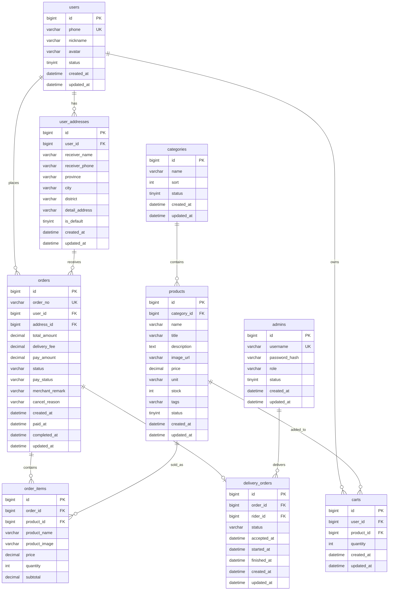

# 乐鲜生活 ERD

## 1. 目标

本文档用于定义乐鲜生活 MVP 阶段的数据库设计，支撑核心流程：

用户下单 -> 商家接单 -> 配送员配送 -> 用户签收

设计原则：

- 优先满足业务闭环。
- 表结构简单清晰。
- 不为理论范式过度拆表。
- 第一阶段只服务 MVP，不提前设计复杂营销、会员、结算和推荐系统。

## 2. 功能说明

MVP 数据库需要支撑以下功能：

- 用户注册登录
- 用户收货地址管理
- 商品分类
- 商品浏览和搜索
- 购物车
- 创建订单
- 支付状态记录
- 商家接单
- 配送员配送
- 用户确认收货
- 管理后台用户、商品、订单管理

## 3. 实体列表

核心实体：

```text
User
UserAddress
Category
Product
Cart
Order
OrderItem
DeliveryOrder
Admin
```

说明：

- User：用户。
- UserAddress：用户收货地址。
- Category：商品分类。
- Product：商品。
- Cart：购物车。
- Order：订单主表。
- OrderItem：订单商品明细。
- DeliveryOrder：配送单。
- Admin：后台、商家、配送员账号。

## 4. 实体关系

```text
User 1:N UserAddress
User 1:N Cart
Product 1:N Cart
Category 1:N Product
User 1:N Order
UserAddress 1:N Order
Order 1:N OrderItem
Product 1:N OrderItem
Order 1:1 DeliveryOrder
Admin 1:N DeliveryOrder
```

### 4.1 ER 图



## 5. 数据结构

### 5.1 users 用户表

| 字段 | 类型 | 约束 | 说明 |
| --- | --- | --- | --- |
| id | bigint unsigned | PK | 用户 ID |
| phone | varchar(20) | NOT NULL, UNIQUE | 手机号 |
| nickname | varchar(50) | NULL | 昵称 |
| avatar | varchar(255) | NULL | 头像 |
| status | tinyint | NOT NULL, DEFAULT 1 | 1 正常，0 禁用 |
| created_at | datetime | NOT NULL | 创建时间 |
| updated_at | datetime | NOT NULL | 更新时间 |

### 5.2 user_addresses 收货地址表

| 字段 | 类型 | 约束 | 说明 |
| --- | --- | --- | --- |
| id | bigint unsigned | PK | 地址 ID |
| user_id | bigint unsigned | NOT NULL | 用户 ID |
| receiver_name | varchar(50) | NOT NULL | 收货人 |
| receiver_phone | varchar(20) | NOT NULL | 收货电话 |
| province | varchar(50) | NOT NULL | 省 |
| city | varchar(50) | NOT NULL | 市 |
| district | varchar(50) | NOT NULL | 区 |
| detail_address | varchar(255) | NOT NULL | 详细地址 |
| is_default | tinyint | NOT NULL, DEFAULT 0 | 是否默认地址 |
| created_at | datetime | NOT NULL | 创建时间 |
| updated_at | datetime | NOT NULL | 更新时间 |

### 5.3 categories 商品分类表

| 字段 | 类型 | 约束 | 说明 |
| --- | --- | --- | --- |
| id | bigint unsigned | PK | 分类 ID |
| name | varchar(50) | NOT NULL | 分类名称 |
| sort | int | NOT NULL, DEFAULT 0 | 排序值，越小越靠前 |
| status | tinyint | NOT NULL, DEFAULT 1 | 1 启用，0 禁用 |
| created_at | datetime | NOT NULL | 创建时间 |
| updated_at | datetime | NOT NULL | 更新时间 |

### 5.4 products 商品表

| 字段 | 类型 | 约束 | 说明 |
| --- | --- | --- | --- |
| id | bigint unsigned | PK | 商品 ID |
| category_id | bigint unsigned | NOT NULL | 分类 ID |
| name | varchar(100) | NOT NULL | 商品名称 |
| title | varchar(150) | NULL | 商品标题 |
| description | text | NULL | 商品描述 |
| image_url | varchar(255) | NULL | 商品主图 |
| price | decimal(10,2) | NOT NULL | 售价 |
| unit | varchar(20) | NOT NULL | 单位，如斤、盒、份 |
| stock | int | NOT NULL, DEFAULT 0 | 库存 |
| tags | varchar(255) | NULL | 标签，逗号分隔 |
| status | tinyint | NOT NULL, DEFAULT 1 | 1 上架，0 下架 |
| created_at | datetime | NOT NULL | 创建时间 |
| updated_at | datetime | NOT NULL | 更新时间 |

### 5.5 carts 购物车表

| 字段 | 类型 | 约束 | 说明 |
| --- | --- | --- | --- |
| id | bigint unsigned | PK | 购物车项 ID |
| user_id | bigint unsigned | NOT NULL | 用户 ID |
| product_id | bigint unsigned | NOT NULL | 商品 ID |
| quantity | int | NOT NULL | 购买数量 |
| created_at | datetime | NOT NULL | 创建时间 |
| updated_at | datetime | NOT NULL | 更新时间 |

业务约束：

- 同一个用户的同一个商品只能有一条购物车记录。
- 加入购物车时如果已存在，则累加数量。

### 5.6 orders 订单表

| 字段 | 类型 | 约束 | 说明 |
| --- | --- | --- | --- |
| id | bigint unsigned | PK | 订单 ID |
| order_no | varchar(32) | NOT NULL, UNIQUE | 订单编号 |
| user_id | bigint unsigned | NOT NULL | 用户 ID |
| address_id | bigint unsigned | NOT NULL | 地址 ID |
| total_amount | decimal(10,2) | NOT NULL | 商品总金额 |
| delivery_fee | decimal(10,2) | NOT NULL, DEFAULT 0.00 | 配送费 |
| pay_amount | decimal(10,2) | NOT NULL | 实付金额 |
| status | varchar(30) | NOT NULL | 订单状态 |
| pay_status | varchar(30) | NOT NULL | 支付状态 |
| merchant_remark | varchar(255) | NULL | 商家备注 |
| cancel_reason | varchar(255) | NULL | 取消原因 |
| created_at | datetime | NOT NULL | 创建时间 |
| paid_at | datetime | NULL | 支付时间 |
| completed_at | datetime | NULL | 完成时间 |
| updated_at | datetime | NOT NULL | 更新时间 |

### 5.7 order_items 订单明细表

| 字段 | 类型 | 约束 | 说明 |
| --- | --- | --- | --- |
| id | bigint unsigned | PK | 订单明细 ID |
| order_id | bigint unsigned | NOT NULL | 订单 ID |
| product_id | bigint unsigned | NOT NULL | 商品 ID |
| product_name | varchar(100) | NOT NULL | 下单时商品名称 |
| product_image | varchar(255) | NULL | 下单时商品图片 |
| price | decimal(10,2) | NOT NULL | 下单时单价 |
| quantity | int | NOT NULL | 数量 |
| subtotal | decimal(10,2) | NOT NULL | 小计 |

说明：

- 商品名称、图片、价格必须冗余保存到订单明细中。
- 后续商品改价或改名，不影响历史订单。

### 5.8 delivery_orders 配送单表

| 字段 | 类型 | 约束 | 说明 |
| --- | --- | --- | --- |
| id | bigint unsigned | PK | 配送单 ID |
| order_id | bigint unsigned | NOT NULL, UNIQUE | 订单 ID |
| rider_id | bigint unsigned | NULL | 配送员账号 ID |
| status | varchar(30) | NOT NULL | 配送状态 |
| accepted_at | datetime | NULL | 接单时间 |
| started_at | datetime | NULL | 开始配送时间 |
| finished_at | datetime | NULL | 完成时间 |
| created_at | datetime | NOT NULL | 创建时间 |
| updated_at | datetime | NOT NULL | 更新时间 |

### 5.9 admins 后台账号表

| 字段 | 类型 | 约束 | 说明 |
| --- | --- | --- | --- |
| id | bigint unsigned | PK | 账号 ID |
| username | varchar(50) | NOT NULL, UNIQUE | 登录账号 |
| password_hash | varchar(255) | NOT NULL | 密码哈希 |
| role | varchar(30) | NOT NULL | admin、merchant、rider |
| status | tinyint | NOT NULL, DEFAULT 1 | 1 正常，0 禁用 |
| created_at | datetime | NOT NULL | 创建时间 |
| updated_at | datetime | NOT NULL | 更新时间 |

## 6. 状态枚举

### 6.1 用户状态

| 值 | 说明 |
| --- | --- |
| 1 | 正常 |
| 0 | 禁用 |

### 6.2 商品状态

| 值 | 说明 |
| --- | --- |
| 1 | 上架 |
| 0 | 下架 |

### 6.3 订单状态

| 值 | 说明 |
| --- | --- |
| pending_payment | 待支付 |
| pending_accept | 待接单 |
| pending_delivery | 待配送 |
| delivering | 配送中 |
| completed | 已完成 |
| cancelled | 已取消 |
| refunded | 已退款 |

### 6.4 支付状态

| 值 | 说明 |
| --- | --- |
| unpaid | 未支付 |
| paid | 已支付 |
| failed | 支付失败 |
| refunded | 已退款 |

### 6.5 配送状态

| 值 | 说明 |
| --- | --- |
| pending | 待接单 |
| accepted | 已接单 |
| delivering | 配送中 |
| finished | 已完成 |
| cancelled | 已取消 |

### 6.6 后台角色

| 值 | 说明 |
| --- | --- |
| admin | 平台管理员 |
| merchant | 商家 |
| rider | 配送员 |

## 7. 索引设计

| 表 | 索引 | 说明 |
| --- | --- | --- |
| users | uk_users_phone(phone) | 手机号唯一登录 |
| user_addresses | idx_user_addresses_user_id(user_id) | 查询用户地址 |
| categories | idx_categories_status_sort(status, sort) | 首页分类展示 |
| products | idx_products_category_status(category_id, status) | 按分类查询商品 |
| products | idx_products_name(name) | 商品搜索 |
| carts | uk_carts_user_product(user_id, product_id) | 避免重复购物车项 |
| orders | uk_orders_order_no(order_no) | 订单编号唯一 |
| orders | idx_orders_user_status(user_id, status) | 用户订单列表 |
| orders | idx_orders_status_created(status, created_at) | 商家和后台筛选订单 |
| order_items | idx_order_items_order_id(order_id) | 查询订单明细 |
| order_items | idx_order_items_product_id(product_id) | 商品销量统计 |
| delivery_orders | uk_delivery_orders_order_id(order_id) | 一个订单一个配送单 |
| delivery_orders | idx_delivery_orders_rider_status(rider_id, status) | 配送员订单列表 |
| admins | uk_admins_username(username) | 后台账号唯一登录 |

## 8. API 设计关联

| 业务接口 | 主要读写表 |
| --- | --- |
| 用户登录 | users |
| 地址管理 | user_addresses |
| 商品分类 | categories |
| 商品列表和详情 | products、categories |
| 购物车 | carts、products |
| 创建订单 | orders、order_items、carts、products、user_addresses |
| 支付成功 | orders |
| 商家接单 | orders、delivery_orders |
| 配送员接单 | delivery_orders、orders |
| 完成配送 | delivery_orders、orders |
| 后台订单管理 | orders、order_items、users、delivery_orders |
| AI 商品文案 | products |
| 商品销售分析 | order_items、orders、products |

## 9. MySQL 建表 SQL

```sql
CREATE TABLE users (
  id BIGINT UNSIGNED NOT NULL AUTO_INCREMENT COMMENT '用户 ID',
  phone VARCHAR(20) NOT NULL COMMENT '手机号',
  nickname VARCHAR(50) DEFAULT NULL COMMENT '昵称',
  avatar VARCHAR(255) DEFAULT NULL COMMENT '头像',
  status TINYINT NOT NULL DEFAULT 1 COMMENT '状态：1 正常，0 禁用',
  created_at DATETIME NOT NULL DEFAULT CURRENT_TIMESTAMP COMMENT '创建时间',
  updated_at DATETIME NOT NULL DEFAULT CURRENT_TIMESTAMP ON UPDATE CURRENT_TIMESTAMP COMMENT '更新时间',
  PRIMARY KEY (id),
  UNIQUE KEY uk_users_phone (phone)
) ENGINE=InnoDB DEFAULT CHARSET=utf8mb4 COMMENT='用户表';

CREATE TABLE user_addresses (
  id BIGINT UNSIGNED NOT NULL AUTO_INCREMENT COMMENT '地址 ID',
  user_id BIGINT UNSIGNED NOT NULL COMMENT '用户 ID',
  receiver_name VARCHAR(50) NOT NULL COMMENT '收货人',
  receiver_phone VARCHAR(20) NOT NULL COMMENT '收货电话',
  province VARCHAR(50) NOT NULL COMMENT '省',
  city VARCHAR(50) NOT NULL COMMENT '市',
  district VARCHAR(50) NOT NULL COMMENT '区',
  detail_address VARCHAR(255) NOT NULL COMMENT '详细地址',
  is_default TINYINT NOT NULL DEFAULT 0 COMMENT '是否默认地址',
  created_at DATETIME NOT NULL DEFAULT CURRENT_TIMESTAMP COMMENT '创建时间',
  updated_at DATETIME NOT NULL DEFAULT CURRENT_TIMESTAMP ON UPDATE CURRENT_TIMESTAMP COMMENT '更新时间',
  PRIMARY KEY (id),
  KEY idx_user_addresses_user_id (user_id)
) ENGINE=InnoDB DEFAULT CHARSET=utf8mb4 COMMENT='收货地址表';

CREATE TABLE categories (
  id BIGINT UNSIGNED NOT NULL AUTO_INCREMENT COMMENT '分类 ID',
  name VARCHAR(50) NOT NULL COMMENT '分类名称',
  sort INT NOT NULL DEFAULT 0 COMMENT '排序值',
  status TINYINT NOT NULL DEFAULT 1 COMMENT '状态：1 启用，0 禁用',
  created_at DATETIME NOT NULL DEFAULT CURRENT_TIMESTAMP COMMENT '创建时间',
  updated_at DATETIME NOT NULL DEFAULT CURRENT_TIMESTAMP ON UPDATE CURRENT_TIMESTAMP COMMENT '更新时间',
  PRIMARY KEY (id),
  KEY idx_categories_status_sort (status, sort)
) ENGINE=InnoDB DEFAULT CHARSET=utf8mb4 COMMENT='商品分类表';

CREATE TABLE products (
  id BIGINT UNSIGNED NOT NULL AUTO_INCREMENT COMMENT '商品 ID',
  category_id BIGINT UNSIGNED NOT NULL COMMENT '分类 ID',
  name VARCHAR(100) NOT NULL COMMENT '商品名称',
  title VARCHAR(150) DEFAULT NULL COMMENT '商品标题',
  description TEXT DEFAULT NULL COMMENT '商品描述',
  image_url VARCHAR(255) DEFAULT NULL COMMENT '商品主图',
  price DECIMAL(10,2) NOT NULL COMMENT '售价',
  unit VARCHAR(20) NOT NULL COMMENT '单位',
  stock INT NOT NULL DEFAULT 0 COMMENT '库存',
  tags VARCHAR(255) DEFAULT NULL COMMENT '标签，逗号分隔',
  status TINYINT NOT NULL DEFAULT 1 COMMENT '状态：1 上架，0 下架',
  created_at DATETIME NOT NULL DEFAULT CURRENT_TIMESTAMP COMMENT '创建时间',
  updated_at DATETIME NOT NULL DEFAULT CURRENT_TIMESTAMP ON UPDATE CURRENT_TIMESTAMP COMMENT '更新时间',
  PRIMARY KEY (id),
  KEY idx_products_category_status (category_id, status),
  KEY idx_products_name (name)
) ENGINE=InnoDB DEFAULT CHARSET=utf8mb4 COMMENT='商品表';

CREATE TABLE carts (
  id BIGINT UNSIGNED NOT NULL AUTO_INCREMENT COMMENT '购物车项 ID',
  user_id BIGINT UNSIGNED NOT NULL COMMENT '用户 ID',
  product_id BIGINT UNSIGNED NOT NULL COMMENT '商品 ID',
  quantity INT NOT NULL COMMENT '购买数量',
  created_at DATETIME NOT NULL DEFAULT CURRENT_TIMESTAMP COMMENT '创建时间',
  updated_at DATETIME NOT NULL DEFAULT CURRENT_TIMESTAMP ON UPDATE CURRENT_TIMESTAMP COMMENT '更新时间',
  PRIMARY KEY (id),
  UNIQUE KEY uk_carts_user_product (user_id, product_id)
) ENGINE=InnoDB DEFAULT CHARSET=utf8mb4 COMMENT='购物车表';

CREATE TABLE orders (
  id BIGINT UNSIGNED NOT NULL AUTO_INCREMENT COMMENT '订单 ID',
  order_no VARCHAR(32) NOT NULL COMMENT '订单编号',
  user_id BIGINT UNSIGNED NOT NULL COMMENT '用户 ID',
  address_id BIGINT UNSIGNED NOT NULL COMMENT '地址 ID',
  total_amount DECIMAL(10,2) NOT NULL COMMENT '商品总金额',
  delivery_fee DECIMAL(10,2) NOT NULL DEFAULT 0.00 COMMENT '配送费',
  pay_amount DECIMAL(10,2) NOT NULL COMMENT '实付金额',
  status VARCHAR(30) NOT NULL COMMENT '订单状态',
  pay_status VARCHAR(30) NOT NULL COMMENT '支付状态',
  merchant_remark VARCHAR(255) DEFAULT NULL COMMENT '商家备注',
  cancel_reason VARCHAR(255) DEFAULT NULL COMMENT '取消原因',
  created_at DATETIME NOT NULL DEFAULT CURRENT_TIMESTAMP COMMENT '创建时间',
  paid_at DATETIME DEFAULT NULL COMMENT '支付时间',
  completed_at DATETIME DEFAULT NULL COMMENT '完成时间',
  updated_at DATETIME NOT NULL DEFAULT CURRENT_TIMESTAMP ON UPDATE CURRENT_TIMESTAMP COMMENT '更新时间',
  PRIMARY KEY (id),
  UNIQUE KEY uk_orders_order_no (order_no),
  KEY idx_orders_user_status (user_id, status),
  KEY idx_orders_status_created (status, created_at)
) ENGINE=InnoDB DEFAULT CHARSET=utf8mb4 COMMENT='订单表';

CREATE TABLE order_items (
  id BIGINT UNSIGNED NOT NULL AUTO_INCREMENT COMMENT '订单明细 ID',
  order_id BIGINT UNSIGNED NOT NULL COMMENT '订单 ID',
  product_id BIGINT UNSIGNED NOT NULL COMMENT '商品 ID',
  product_name VARCHAR(100) NOT NULL COMMENT '下单时商品名称',
  product_image VARCHAR(255) DEFAULT NULL COMMENT '下单时商品图片',
  price DECIMAL(10,2) NOT NULL COMMENT '下单时单价',
  quantity INT NOT NULL COMMENT '数量',
  subtotal DECIMAL(10,2) NOT NULL COMMENT '小计',
  PRIMARY KEY (id),
  KEY idx_order_items_order_id (order_id),
  KEY idx_order_items_product_id (product_id)
) ENGINE=InnoDB DEFAULT CHARSET=utf8mb4 COMMENT='订单明细表';

CREATE TABLE delivery_orders (
  id BIGINT UNSIGNED NOT NULL AUTO_INCREMENT COMMENT '配送单 ID',
  order_id BIGINT UNSIGNED NOT NULL COMMENT '订单 ID',
  rider_id BIGINT UNSIGNED DEFAULT NULL COMMENT '配送员账号 ID',
  status VARCHAR(30) NOT NULL COMMENT '配送状态',
  accepted_at DATETIME DEFAULT NULL COMMENT '接单时间',
  started_at DATETIME DEFAULT NULL COMMENT '开始配送时间',
  finished_at DATETIME DEFAULT NULL COMMENT '完成时间',
  created_at DATETIME NOT NULL DEFAULT CURRENT_TIMESTAMP COMMENT '创建时间',
  updated_at DATETIME NOT NULL DEFAULT CURRENT_TIMESTAMP ON UPDATE CURRENT_TIMESTAMP COMMENT '更新时间',
  PRIMARY KEY (id),
  UNIQUE KEY uk_delivery_orders_order_id (order_id),
  KEY idx_delivery_orders_rider_status (rider_id, status)
) ENGINE=InnoDB DEFAULT CHARSET=utf8mb4 COMMENT='配送单表';

CREATE TABLE admins (
  id BIGINT UNSIGNED NOT NULL AUTO_INCREMENT COMMENT '账号 ID',
  username VARCHAR(50) NOT NULL COMMENT '登录账号',
  password_hash VARCHAR(255) NOT NULL COMMENT '密码哈希',
  role VARCHAR(30) NOT NULL COMMENT '角色：admin、merchant、rider',
  status TINYINT NOT NULL DEFAULT 1 COMMENT '状态：1 正常，0 禁用',
  created_at DATETIME NOT NULL DEFAULT CURRENT_TIMESTAMP COMMENT '创建时间',
  updated_at DATETIME NOT NULL DEFAULT CURRENT_TIMESTAMP ON UPDATE CURRENT_TIMESTAMP COMMENT '更新时间',
  PRIMARY KEY (id),
  UNIQUE KEY uk_admins_username (username)
) ENGINE=InnoDB DEFAULT CHARSET=utf8mb4 COMMENT='后台账号表';
```

## 10. 开发步骤

1. 使用本文档中的 SQL 创建 MySQL 表。
2. 初始化基础分类和测试商品。
3. 创建管理员、商家、配送员测试账号。
4. 开发用户登录和地址管理接口。
5. 开发商品、购物车、订单接口。
6. 创建订单时使用事务扣减库存。
7. 商家接单后创建或更新配送单。
8. 配送员完成配送后更新配送单和订单状态。
9. 后台根据订单表和订单明细表做基础查询。

## 11. 风险分析

### 11.1 不使用外键的风险

第一阶段建议不强制使用数据库外键，降低开发和数据修复成本。

风险：

- 可能出现孤立数据。

控制方式：

- 在业务代码中校验关联数据是否存在。
- 删除数据优先采用禁用或下架，不做物理删除。
- 后台定期检查异常数据。

### 11.2 库存并发风险

风险：

- 多个用户同时下单可能导致超卖。

控制方式：

- 创建订单时开启事务。
- 扣库存 SQL 必须带条件：`stock >= quantity`。
- 扣减失败则提示库存不足。

### 11.3 历史订单变更风险

风险：

- 商品改价、改名后影响历史订单展示。

控制方式：

- `order_items` 保存下单时商品名称、图片、价格。
- 订单详情优先读取 `order_items`，不直接依赖商品实时信息。

### 11.4 状态混乱风险

风险：

- 订单、支付、配送状态如果随意更新，会造成履约错误。

控制方式：

- 后端统一封装订单状态流转。
- 每个接口只允许从指定状态进入下一个状态。
- 后续可增加订单状态日志表，MVP 阶段暂不开发。

## 12. 上线方案

### 12.1 上线前准备

- 在测试环境执行建表 SQL。
- 插入初始分类和商品。
- 创建后台管理员账号。
- 跑通用户下单、商家接单、配送完成流程。
- 检查订单金额、库存扣减、订单状态是否正确。

### 12.2 生产上线

- 生产数据库使用 MySQL 8。
- 字符集统一使用 `utf8mb4`。
- 金额字段统一使用 `DECIMAL(10,2)`。
- 每天至少备份一次数据库。
- 上线初期保留模拟支付开关，正式交易时关闭。

### 12.3 后续数据库优化

等真实运营数据出现后，再考虑增加：

- payment_records 支付流水表
- order_status_logs 订单状态日志表
- refunds 售后退款表
- coupons 优惠券表
- product_images 商品多图表
- stock_records 库存流水表

这些表不进入 MVP，避免拖慢上线。
